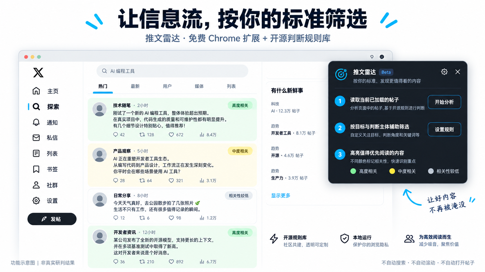
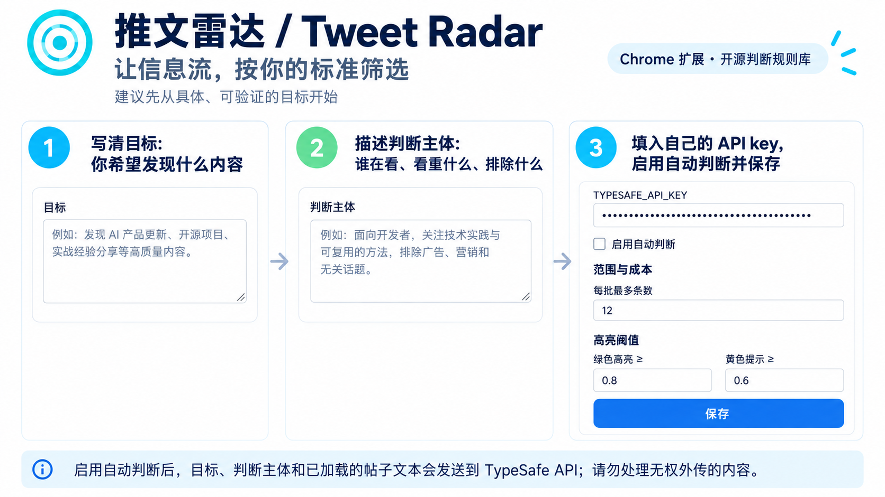
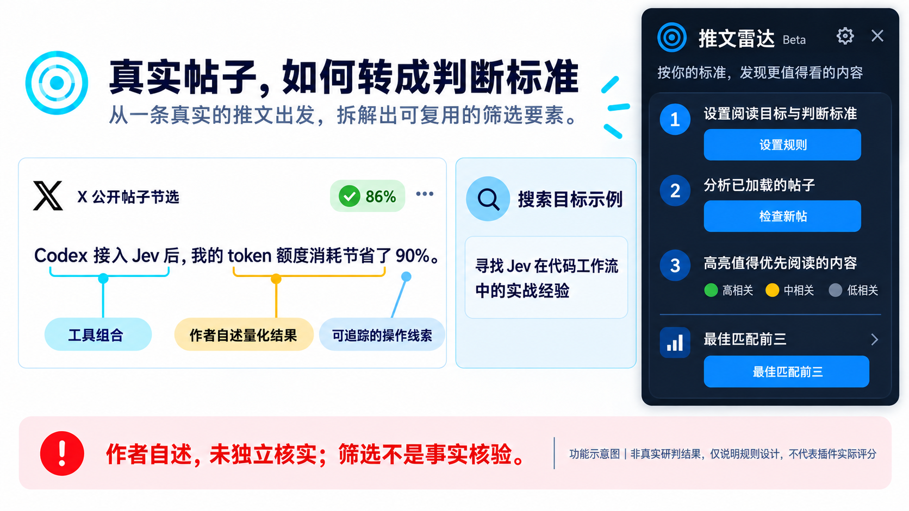
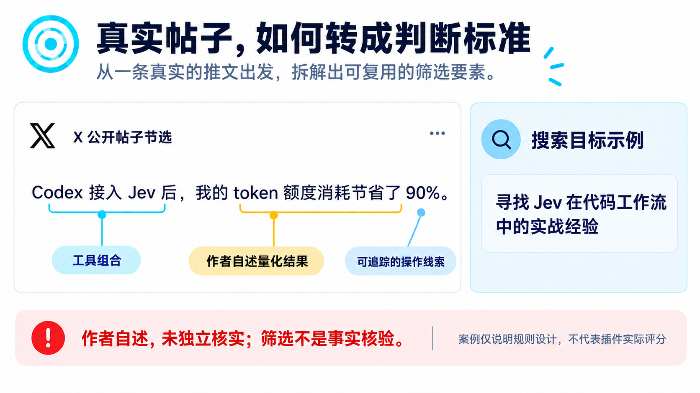
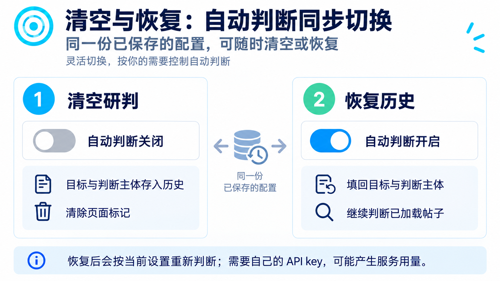

# Tweet Radar · 推文雷达

**Find posts worth reading on X using criteria you choose.**

A community library of content curation rules and prompts, with an optional free Chrome extension.

[简体中文](README.md) · **English** · [Rule templates](prompts/) · [MIT License](LICENSE)

*A generated illustration of the extension in an X feed, not a live screenshot or a real model result. The current controls are described below. The extension UI is currently in Chinese.*

## What it does

You write a goal and a reader profile. The extension reads posts already loaded in your X tab and sends them to TypeSafe Jev for a relevance judgment. It marks posts with a colored icon and a percentage so you can decide what to read first.

The browser extension is a small part of this project. We also want to collect reusable rules, prompts, examples, and counterexamples for judging online content. Contributions to those materials are welcome.

The extension does not search X, scroll the page, open posts, or call the X API on its own. It is a reading aid, not a fact checker. The percentage is a model judgment, not a measured accuracy rate.

## Install and start

1. Download and unzip this repository, or run `git clone https://github.com/kelaocai/tweet-radar.git`.
2. Open `chrome://extensions` in Chrome or another Chromium browser and turn on **Developer mode**.
3. Click **Load unpacked** and select the repository's `extension/` folder. Select that folder, not the repository root. No build step is needed.
4. Click the Tweet Radar toolbar icon to open settings. Fill in **目标** (Goal), **判断主体** (Reader profile), and **TYPESAFE_API_KEY** with your own TypeSafe key. Check **启用自动判断** (Enable automatic judgment), then click **保存** (Save).
5. Open an X search page or timeline. As posts load, the extension evaluates them in batches and adds colored badges. Scroll normally to load more posts.

The extension is currently installed through Developer mode; it is not published in the Chrome Web Store. TypeSafe may charge for API use. Check your account's pricing and limits before turning on automatic judgment.

*The checkbox in this illustration is still off. Turn it on and save when you are ready for the extension to send loaded posts to TypeSafe.*

## Using the Chinese interface

| Label in the extension | Meaning | What happens |
| --- | --- | --- |
| 设置规则 | Set rules | Opens the settings page. |
| 检查新帖 | Check new posts | Checks loaded posts that have not been processed yet. With automatic judgment enabled, newly loaded posts are also checked as you browse. |
| 最佳匹配前三 | Top matches | Compares eligible posts in pairs and shows links to up to three matches. It does not reorder the X page and uses additional API tokens. |
| 继续判断 | Continue judging | Allows another batch after the configured per-page limit is reached. |
| 清空研判并关闭自动判断（存入历史） | Clear judgment and turn off automatic judgment | Saves the goal and reader profile to local history, clears page markings, and turns automatic judgment off. |
| 恢复 | Restore | Restores a saved goal and reader profile and turns automatic judgment back on. |

The **Top matches** action becomes available when at least two judged posts on the current page meet the entry threshold. By default, it compares at most 12 candidates. That can mean 66 pairwise questions, so use it when you want a short recommendation list. With only two candidates, it returns two results.

Click **×** to collapse the panel; click the radar button to reopen it. Green, yellow, and gray badges indicate different relevance levels. The badge icon and percentage show the initial judgment; a top-match number appears after comparison.

*Generated UI illustration. The 86% badge is an example, not a real result.*

## A public-post example

This [public X post](https://x.com/goan999999/status/2101657121746198981) contains the author's own claim about token use after adopting Jev. The image below points to details a rule could look for: the tools used, a measurable claim, and a lead worth checking. We have not independently verified the claim. The image is not an extension score.

## Clear and restore a judgment

Clearing a judgment turns automatic checking off and removes badges from open X pages. The goal and reader profile go into local history. Restoring an entry fills them back in and turns automatic checking on; open X tabs may judge loaded posts again and incur new API use. The API key stays in your local extension settings and is never copied into the judgment history.

## Privacy and cost

- The content script reads loaded post text, author handles, post links, and visible engagement counts from the X page.
- The extension sends post text, author handles, visible engagement counts, your goal, and reader profile to `https://api.typesafe.ai/v1/systemone`. Your API key goes in the HTTPS authorization header.
- The key, current settings, and up to 50 saved goal/profile pairs live in Chrome's local extension storage. This project does not encrypt that storage or run its own backend.
- Do not use the extension on content you are not allowed to send to a third party. Do not post keys, cookies, private messages, or personal data in GitHub issues.
- The extension is free and open source. External API charges and data handling follow the provider's current terms.

See [Security and privacy](SECURITY.md) for the full data flow and private vulnerability reporting. That document is mainly in Chinese, with a short English scope section.

## Get help

If badges do not appear, check that you saved a goal, reader profile, and valid API key with **启用自动判断** enabled. Reload the extension at `chrome://extensions`, then refresh your X tab after updating the source files. If **最佳匹配前三** is unavailable, the page needs at least two judged posts above the entry threshold.

For bugs and feature ideas, [open an issue](https://github.com/kelaocai/tweet-radar/issues). Remove private content and credentials first. Use the private reporting route in [SECURITY.md](SECURITY.md) for security problems.

## Contribute

The most useful contributions are clear goals, reader profiles, evidence rules, exclusion rules, and examples that show where a rule fails. The [rule templates](prompts/) and [examples](examples/) are mostly in Chinese today; English contributions and translations are welcome. Open an issue or pull request with fictional, authorized, or well-redacted examples. Never include an API key or private post content.

For the full contribution process, see [CONTRIBUTING.md](CONTRIBUTING.md) (Chinese). The project uses the [MIT License](LICENSE). More background is in the [installation guide](docs/INSTALLATION.md) and [judgment model](docs/JUDGMENT_MODEL.md), both currently in Chinese.

## Support the project

If you find the project useful, you can [buy me a coffee through PayPal](https://paypal.me/kelaocai), or scan the Alipay QR code below.

  

